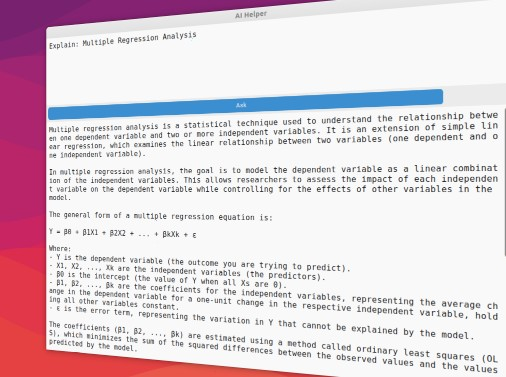

# AI Helper



Simple AI helper utility for daily tasks.

This utility is specifically designed to be used with global hotkeys, allowing you to quickly and easily find the answer
you need. By using your clipboard, you can speed up your workflow. Simply copy the text or concept you want to rephrase
or explain, and then press the global hotkey. The application will take the content from the clipboard as the input
and then copy the answer back to the clipboard.

When you're using the application, simply press `Ctrl+Enter` in question field to get the answer.
If you want to exit the application, just press `ESC`.

## Pre-requisites

- Python 3.7.1 or higher
- OpenAI API key. Set the key in the `OPENAI_API_KEY` environment variable.

## Install dependencies

```bash
pip3 install -r requirements.txt
```

## Setup global hotkeys in Ubuntu

This application is designed to work with global hotkeys. To set them up in Ubuntu, follow these steps:

Open _Settings -> Keyboard Shortcuts -> Custom Shortcuts_ and create the following shortcuts:

### Rewrite text

This feature automatically rewrites any text currently in the clipboard to improve clarity and grammar.
The newly rewritten text will be displayed in the user interface and then placed back into the clipboard.

| Name               | Suggested shortcut   | Command                        | Description                   |
|--------------------|----------------------|--------------------------------|-------------------------------|
| AI Helper: Rewrite | `Ctrl+Alt+Shift+F10` | `python3 ai_helper.py Rewrite` | Rewrite text using AI helper. |

### Ask question

This feature takes the content of the clipboard and puts it into the question field in the following format:

```
Explain: <CLIPBOARD_CONTENT>
```

To send this question to OpenAI, simply press `Ctrl+Enter`. The answer will be displayed in the user interface.

| Name           | Suggested shortcut   | Command                    | Description               |
|----------------|----------------------|----------------------------|---------------------------|
| AI Helper: Ask | `Ctrl+Alt+Shift+F11` | `python3 ai_helper.py Ask` | Ask AI helper a question. |

### Execute custom prompt

This feature automatically loads and runs the last custom prompt you used.
The custom prompt can contain a placeholder (`{CLIPBOARD}`), which will be replaced with the contents of your current
clipboard.

Example custom prompt:

```
Create a short summary of the following text:

---
{CLIPBOARD}
---
```

| Name                    | Suggested shortcut   | Command                             | Description            |
|-------------------------|----------------------|-------------------------------------|------------------------|
| AI Helper: CustomPrompt | `Ctrl+Alt+Shift+F12` | `python3 ai_helper.py CustomPrompt` | Execute custom prompt. |
